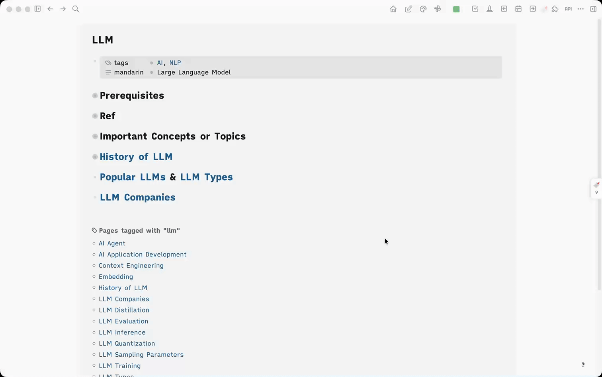

# Logseq Raindrop

A Logseq plugin that integrates with [Raindrop.io](https://raindrop.io) bookmarks. Sync your bookmarks locally and view them alongside your notes when page names match Raindrop tags



## Background

i read many articles and watch many videos everyday, and i will save some of the impressive contents to my raindrop, take some notes, and tag them

the tag names are the same as logseq page names, so when i am doing research on some topics, i can use these tags to search what i've read and watched

i use this plugin to make this habit more convinient

also i find there is someone sync every raindrop bookmark to one logseq page. i don't like this way, coz there will be so many pages

## Background

## Features

- **Bookmark Sync** - Batch sync all Raindrop.io bookmarks to local storage via the Raindrop API

- **Auto Sync on Startup** - Optionally sync bookmarks automatically when Logseq launches (enabled by default, configurable in settings)

- **Tag-based Page Matching** - When you navigate to a Logseq page, if the page name matches a Raindrop tag (case-insensitive), related bookmarks appear in a right-side panel

- **Dual-column Layout** - The bookmark panel opens on the right side of the page, pushing the main content left so you can continue editing while viewing bookmarks

- **Bookmark Cards** - Each bookmark displays title (clickable link), domain, collection name, saved date, and notes

## Setup

1. Get a **Test Token** from [Raindrop.io Integrations](https://app.raindrop.io/settings/integrations)
2. Install the plugin in Logseq
3. Go to plugin settings and paste your token into **Raindrop API Token**
4. Click the toolbar button (bookmark icon) and hit **Sync Now**, or let it auto-sync on next startup

## Development

Requires [pnpm](https://pnpm.io/installation).

```bash
pnpm install
pnpm dev      # Dev server with HMR
pnpm build    # Production build (outputs to dist/)
```

To load in Logseq: enable developer mode, go to Plugins, select "Load unpacked plugin", and choose the project root directory
